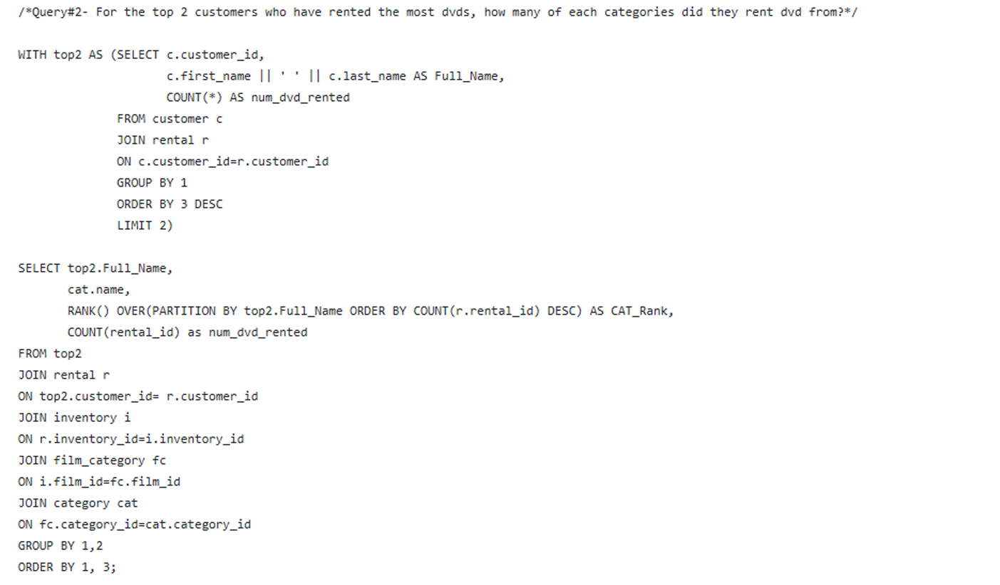
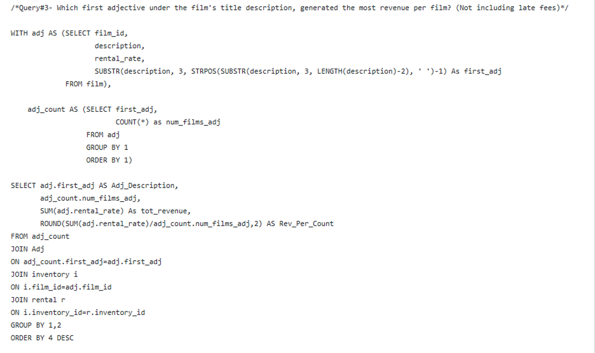

# OVERVIEW

This is Udacity's first project under Programming for Data Science Nanodegree Program. This project was focused on exploring a relational database using SQL. (Created on September 10, 2018)

This project focuses on gaining on hand experience with exploring a relational database. This project uses SQL and data visualization to explore the Sakila Movie Database. As part of this project, we are to ask interesting questions about the data and create and run SQL queries to answer these questions.

**This project includes:**
+ A [set of slides](report.pdf) with a question, visualization, and small summary on each slide.
+ A [text file](queries.txt)  with my queries needed to answer each of the four questions.

# ABOUT THE DATASET

The Sakila Movie Database is a fictional database that represents the business process of a DVD rental store. The sample database contains 15 tables and can be found [here.](http://www.postgresqltutorial.com/postgresql-sample-database/)

[**DVD RENTAL ER MODEL**](dvd-rental-erd.pptx)

 _  _  _  _  _  _  _  _  _  __  _  _  _  _  _  _  _  _  _  _  _  _  _  _  _  _  _  _  _  _  _  _  _  _  _  _  _  _  _  _    _  _  _  _  _  _  _  _  _  _  _  _  _  _  _  _  _  _  _  _  _  _  _  _  _  _  _  _  _  _  _  _  _  _  _  _  _  _  _  _  _  _  _  

## QUESTION \#1

## QUESTION \#2

## QUESTION \#3

## QUESTION \#4

